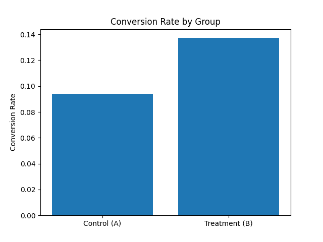

# Product A/B Testing Analysis

A data analytics project that simulates a real-world product experiment to evaluate whether a new feature improves user conversion rates using statistical testing and segmentation analysis.

---

## Overview

This project demonstrates how data scientists and product analysts evaluate the impact of product changes using A/B testing.

A simulated dataset is used to compare two user experiences:

- **Group A (Control):** Baseline product experience
- **Group B (Treatment):** New feature or variation

The goal is to determine whether the treatment leads to a statistically significant improvement in user behavior.

---

## Real-World Context

This project simulates a common product analytics scenario where a company tests a new feature to improve user conversion.

Examples of real-world use cases include:

- A redesigned signup page  
- A new checkout flow in an e-commerce app  
- A different call-to-action button  
- An improved onboarding experience  

In this simulation:

- **Conversion** represents whether a user completed a key action (e.g., signup or purchase)
- The experiment evaluates whether the new experience (B) outperforms the baseline (A)

---

## Methodology

### 1. Conversion Rate Calculation

- Aggregated total conversions and user counts by group  
- Computed conversion rate for each variant  

### 2. Statistical Testing

- Applied a **two-proportion Z-test** to compare conversion rates  
- Evaluated statistical significance using a p-value threshold of 0.05  

### 3. Lift Analysis

- **Absolute Lift:** Difference in conversion rates (B − A)  
- **Relative Lift:** Percent improvement over baseline  

### 4. Segmentation Analysis

- Analyzed conversion performance by **device type (desktop vs mobile)**  
- Identified where the experiment had the strongest impact  

---

## Results

| Group | Conversion Rate |
|------|-----------------|
| Control (A) | 9.38% |
| Treatment (B) | 13.73% |

### Lift

- **Absolute Lift:** +4.34 percentage points  
- **Relative Lift:** +46.21%  

### Statistical Test

- **Z-statistic:** -2.1414  
- **P-value:** 0.0322  

**Result:** Statistically significant improvement  

---

## Visualization



This chart provides a visual comparison of conversion rates between the control and treatment groups, highlighting the improvement introduced by the new feature.

---

## Segment Insights

### Conversion by Device

| Device | A (Control) | B (Treatment) |
|--------|-------------|---------------|
| Desktop | 9.96% | 12.35% |
| Mobile | 8.88% | 14.98% |

### Device-Level Lift

| Device | Absolute Lift | Relative Lift |
|--------|---------------|---------------|
| Desktop | +2.39% | +24% |
| Mobile | +6.10% | +69% |

### Key Insight

The treatment improved conversion across both segments, but the effect was significantly stronger on **mobile users**.

This suggests that the feature or design change is particularly effective in a mobile context and may warrant prioritizing mobile rollout or further investigation into mobile-specific user behavior.

---

## Conclusion

The A/B test indicates that the treatment (Group B) significantly improves user conversion compared to the control.

- The improvement is **statistically significant**
- The impact is **substantially higher on mobile users**
- The results support **rolling out the feature**, with potential prioritization for mobile platforms

From a product perspective, this suggests the new experience meaningfully improves user engagement and conversion behavior. The results support deploying the feature broadly, while continuing to monitor performance post-launch and exploring additional optimizations—particularly for mobile users where the impact is strongest.

---

## Technologies Used

- Python  
- Pandas  
- Statsmodels  
- NumPy  

---

## Project Structure

```
product_ab_testing_analysis/
├── data/
│   └── ab_test_data.csv
├── src/
│   ├── generate_data.py
│   └── ab_analysis.py
├── README.md
└── requirements.txt
```

---

## How to Run

### 1. Install dependencies
```
pip install -r requirements.txt
```

### 2. Generate dataset
```
python src/generate_data.py
```

### 3. Run analysis
```
python src/ab_analysis.py
```

---

## Author

Benjamin Harris